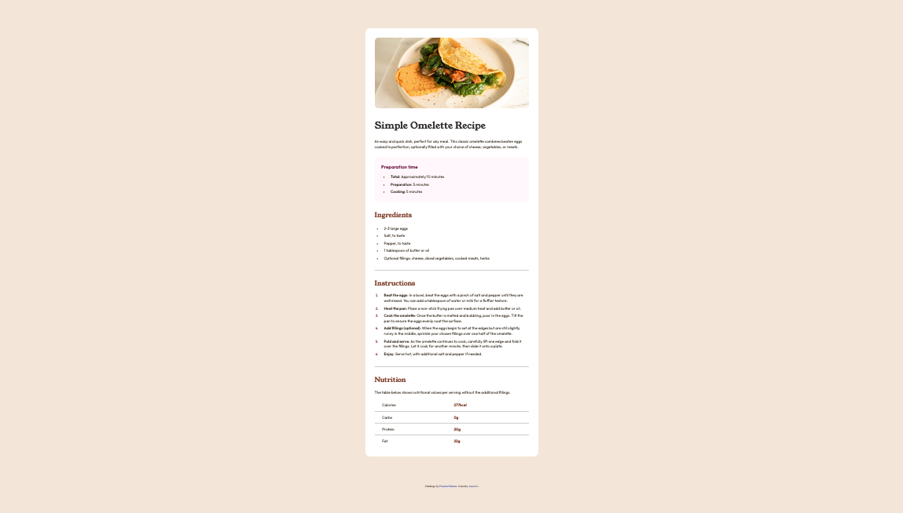

# Frontend Mentor - Recipe page solution

This is a solution to the [Recipe page challenge on Frontend Mentor](https://www.frontendmentor.io/challenges/recipe-page-KiTsR8QQKm). Frontend Mentor challenges help you improve your coding skills by building realistic projects. 

## Table of contents

- [Overview](#overview)
  - [The challenge](#the-challenge)
  - [Screenshot](#screenshot)
  - [Links](#links)
- [My process](#my-process)
  - [Built with](#built-with)
  - [What I learned](#what-i-learned)
  - [Continued development](#continued-development)
- [Author](#author)

## Overview

### Screenshot

### Links

- Solution URL: https://github.com/aaronli722/Recipe-page-challenge-on-Frontend-Mentor
- Live Site URL: https://aaronli722.github.io/Recipe-page-challenge-on-Frontend-Mentor/

## My process

### Built with

- HTML
- CSS

### What I learned

 - measure size of the components in an image using Firefox ruler tool
 - style the list bullet point including the size and color using li::marker
 - make the table row border line a continuous line using border-collapse: collapse
 - make use of ::first-child and last::child

### Continued development

- cleaner and more concise code
- look for a better way to measure size and dimension of the components in an image

## Author

- Frontend Mentor - [@aaronli722](https://www.frontendmentor.io/profile/aaronli722)
- Twitter - [@luenlun](https://www.twitter.com/luenlun)